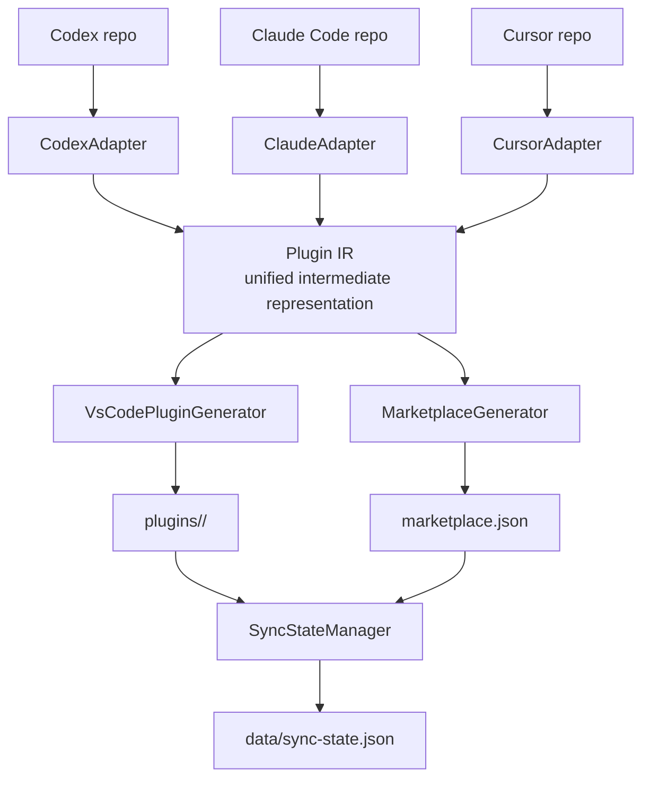

# Agent Plugin Marketplace

Cross-platform agent plugin sync pipeline. Pulls plugins from **Codex**, **Claude Code**, and **Cursor** upstream repos, converts them to **VS Code / GitHub Copilot** compatible format, and publishes a Git-hosted marketplace manifest.

## Quick Start

```bash
bun install
bun run sync        # clone upstreams → convert → generate marketplace.json
```

Outputs:

| Path | Purpose |
|------|---------|
| `plugins/` | Generated VS Code plugin directories |
| `marketplace.json` | Marketplace manifest listing all plugins |
| `data/sync-state.json` | Incremental sync bookkeeping |
| `.cache/sync/` | Local upstream repo clones (gitignored) |

---

## Using Plugins in GitHub Copilot

### Option A: Copilot CLI Marketplace (Recommended)

This repository publishes a standard `.github/plugin/marketplace.json` that the Copilot CLI can consume directly.

```bash
# Add this marketplace to Copilot CLI
copilot plugin marketplace add <owner>/agent-plugin-marketplace

# Or add from a local clone
copilot plugin marketplace add /path/to/agent-plugin-marketplace

# Browse available plugins in this marketplace
copilot plugin marketplace browse agent-plugin-marketplace

# Install a specific plugin from this marketplace
copilot plugin install <plugin-name>@agent-plugin-marketplace

# List installed plugins
copilot plugin list

# Update an installed plugin
copilot plugin update <name>

# Uninstall a plugin
copilot plugin uninstall <name>
```

### Option B: Self-Hosted — Fork and Customize

Fork this repository, then run the sync pipeline yourself to maintain your own marketplace with customizations.

```bash
# 1. Fork and clone
git clone https://github.com/<you>/agent-plugin-marketplace.git
cd agent-plugin-marketplace

# 2. Install and sync
bun install
bun run sync

# 3. Review generated plugins, customize as needed
# 4. Push — your fork is now a live marketplace
git add -A && git commit -m "chore: sync upstream plugins" && git push
```

**To override upstream repo URLs** (e.g. private forks):

```bash
CODEX_REPO_URL=https://github.com/your-org/codex-plugins.git \
CLAUDE_CODE_REPO_URL=https://github.com/your-org/claude-plugins.git \
CURSOR_REPO_URL=https://github.com/your-org/cursor-plugins.git \
bun run sync
```

### Option C: Manual Plugin Install

Copy any plugin directory straight into your project:

```bash
# Copy a single plugin into your workspace
cp -r plugins/claude--code-review/ .github/copilot/plugins/code-review/

# Or symlink for easy updates
ln -s "$(pwd)/plugins/claude--code-review" .github/copilot/plugins/code-review
```

Skills (`.md` files), agents, and instructions are immediately available to Copilot after reload.

---

## How the Sync Pipeline Works



### Sync Steps

1. **Clone / pull** each upstream repo into `.cache/sync/<platform>/`
2. **Discover** plugins via platform-specific marker directories (`.codex-plugin/`, `.claude-plugin/`, `.cursor-plugin/`)
3. **Check** per-plugin commit SHA against `sync-state.json` — skip if unchanged
4. **Parse** each plugin into a unified `PluginIR` via its platform adapter
5. **Generate** VS Code plugin directory with converted files under `plugins/`
6. **Build** `marketplace.json` (and `.github/plugin/marketplace.json`) from all `plugins/*/plugin.json` + `_meta.json` pairs
7. **Persist** sync state for next incremental run

### Incremental Sync

The pipeline tracks each plugin's latest commit SHA. On re-run, only plugins whose source files actually changed are re-generated. This keeps sync fast and diff-friendly for PR reviews.

---

## Upstream Adapter Conversion

| Source Platform | Feature | VS Code Output | Compatibility | Notes |
|----------------|---------|----------------|---------------|-------|
| Any | Skills (`.md`) | Copied as-is | Full | No format conversion needed |
| Any | MCP servers | Copied as-is | Full | Transport and server metadata are preserved |
| Claude Code | Hooks | Copied as Claude-compatible config | Full | VS Code natively reads Claude hook format |
| Claude Code | Agents (`.md`) | Copied as-is | Full | VS Code natively reads `.claude/agents/*.md` |
| Claude Code / Cursor | Commands (`.sh` / `.js` / `.ts`) | Copied as scripts | Partial | No direct VS Code command equivalent |
| Codex | Agents (`.yaml` / `.yml`) | Converted to Markdown agent files | Partial | `name`, `description`, and `developer_instructions` are preserved; unsupported fields are dropped |
| Codex | Hooks (`hooks.json`) | Copied with compatibility warning | Partial | Requires format conversion; limited to 5 events with Bash-only interception |
| Cursor | Rules (`.mdc`) | Converted to `.instructions.md` | Partial | Rules with `alwaysApply: false` and no globs are mapped broadly to `applyTo: "**"` |
| Codex | App connectors (`.app.json`) | Dropped | Unsupported | No VS Code equivalent |

Each generated `_meta.json` includes `_compatibility` metadata with per-component details and warnings, including platform-specific notes for converted or downgraded components.

---

## Supported Platforms

| Platform | Upstream Repo | Adapter |
|----------|--------------|---------|
| Codex (OpenAI) | `https://github.com/openai/plugins.git` | `CodexAdapter` |
| Claude Code (Anthropic) | `https://github.com/anthropics/claude-code.git` | `ClaudeAdapter` |
| Cursor | `https://github.com/cursor/plugins.git` | `CursorAdapter` |

---

## CI / Automated Sync

Two GitHub Actions workflows automate the full lifecycle:

### Sync Workflow (`.github/workflows/sync.yml`)

Runs weekly (Friday 03:00 UTC) and on manual dispatch:

1. Checks out the repo, installs Bun, runs `bun run sync`
2. If `plugins/`, `marketplace.json`, `.github/plugin/marketplace.json`, or `data/sync-state.json` changed, creates a PR with a rich diff summary (added/removed/changed plugins)
3. Optionally sends Slack and/or Discord notifications

**Schedule configuration:** Edit the `cron` lines in `sync.yml` to switch between weekly and daily. The `workflow_dispatch` input is informational only.

**Webhook notifications:** Add `SLACK_WEBHOOK_URL` and/or `DISCORD_WEBHOOK_URL` as repository secrets. Both are optional — the workflow silently skips notifications when secrets are not configured.

### CI Workflow (`.github/workflows/ci.yml`)

Runs on every pull request to `main`:

1. Type-checks with `bun run build`
2. Runs the full test suite with `bun test`

Set the `validate` job as a required status check in branch protection to gate PR merges.

### Setup

Push this repo to GitHub and ensure Actions are enabled. The sync workflow uses `GITHUB_TOKEN` — no extra secrets required for the core sync. Webhook secrets are optional.

---

## Project Structure

```
src/
├── index.ts                  # CLI entrypoint (sync command)
├── adapters/
│   ├── codex.ts              # Codex plugin discovery + parsing
│   ├── claude.ts             # Claude Code plugin discovery + parsing
│   └── cursor.ts             # Cursor plugin discovery + parsing
├── generator/
│   ├── vscode-plugin.ts      # IR → VS Code plugin directory + plugin.json
│   └── marketplace.ts        # All plugins → marketplace.json
├── sync/
│   ├── pipeline.ts           # Orchestrates clone → parse → generate → state
│   └── sync-state.ts         # Tracks per-plugin commit SHA for incremental sync
└── utils/
    └── git.ts                # Git clone/pull/SHA helpers
```

---

## Environment Variables

| Variable | Default | Purpose |
|----------|---------|---------|
| `CODEX_REPO_URL` | `https://github.com/openai/plugins.git` | Override Codex upstream |
| `CLAUDE_CODE_REPO_URL` | `https://github.com/anthropics/claude-code.git` | Override Claude Code upstream |
| `CURSOR_REPO_URL` | `https://github.com/cursor/plugins.git` | Override Cursor upstream |
| `MARKETPLACE_OWNER_NAME` | `agent-plugin-marketplace` | Marketplace owner name |
| `MARKETPLACE_OWNER_EMAIL` | — | Marketplace owner email |
| `MARKETPLACE_OWNER_URL` | — | Marketplace owner URL |
| `MARKETPLACE_DESCRIPTION` | `Cross-platform agent plugins converted for VS Code` | Marketplace description |
| `SYNC_REPORT_PATH` | — | Write Markdown sync report to this path (used by CI) |

---

## Development

```bash
bun install              # install dependencies
bun test                 # run tests
bun run build            # compile TypeScript → dist/
bun run sync             # full sync pipeline
```

### Add a New Platform Adapter

1. Create `src/adapters/<platform>.ts` implementing the `SourceAdapter` interface
2. Register in `createPipeline()` in `src/index.ts`
3. Add tests covering discovery, parsing, compatibility, and sync

---

## Roadmap

Delivered milestones are kept here for historical context. `1.0.0` shipped the v0.2 and v0.3 work below.

### Delivered

#### v0.2 — Automated Upstream Sync (CI) ✓

- Rich PR descriptions with diff summary (added/removed/changed plugin counts)
- Configurable sync frequency (daily / weekly / on-demand) via workflow inputs
- Slack / Discord webhook notification on sync PR creation
- CI validation: type-check + test gate before PR merge

#### v0.3 — Copilot-Native Integration ✓

- Standard `.github/plugin/marketplace.json` written on every sync (complete)
- `plugin.json` now contains only official Copilot CLI manifest fields with `strict: false`
- Per-plugin `_meta.json` sidecar preserves source platform, compatibility, and display metadata
- Support Copilot custom instructions (`.instructions.md`) as a first-class conversion target

### Planned

#### v0.4 — Plugin Quality and Curation

- Add automated compatibility testing: install each plugin in a headless VS Code instance and verify activation
- Implement plugin scoring based on upstream activity, compatibility level, and component coverage
- Add a `curated` tag to manually reviewed plugins, with an allowlist/blocklist mechanism
- Generate a browsable static site (GitHub Pages) from `marketplace.json` for human discovery

#### v0.5 — Multi-Target Generation

- Support Cursor as an output target (reverse adapter: IR → Cursor `.mdc` rules)
- Support Claude Code as an output target (IR → Claude Code plugin format)
- Enable cross-pollination: install a Codex plugin in Cursor, or a Cursor plugin in Claude Code
- Add `bun run generate --target=copilot|cursor|claude` CLI flag

#### v0.6 — Cloud-Native Automation

- Move sync pipeline to a cloud-native runtime (Cloudflare Workers / AWS Lambda) for serverless execution
- Support event-driven sync: trigger on upstream repo webhook push events instead of polling
- Add a central registry API (`GET /plugins`, `GET /plugins/:name`) for programmatic access
- Implement plugin versioning with semver: track upstream version bumps and generate changelogs
- Add telemetry: track plugin install counts and surface popular plugins in the marketplace

---

## License

See upstream plugin repositories for individual plugin licenses. This pipeline code is provided as-is.
